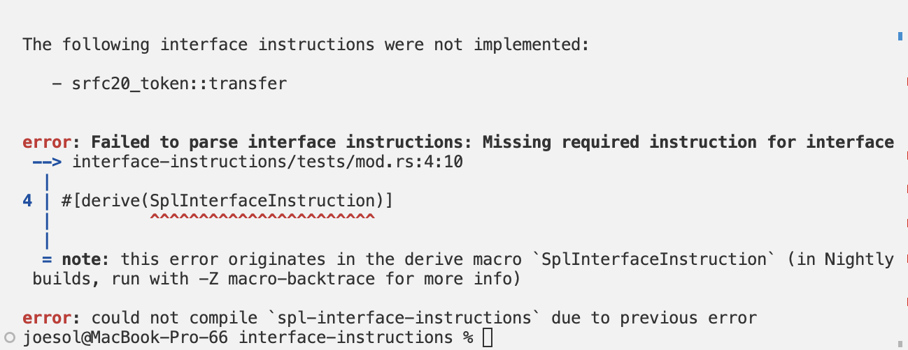
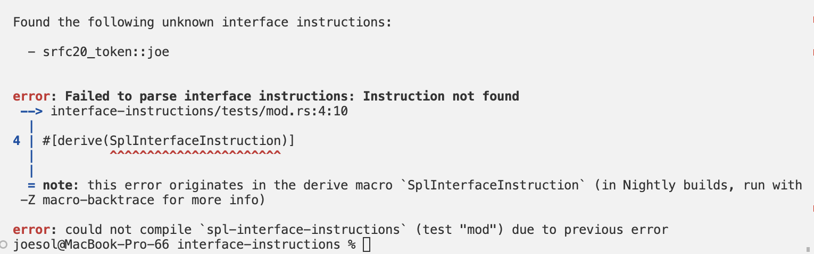
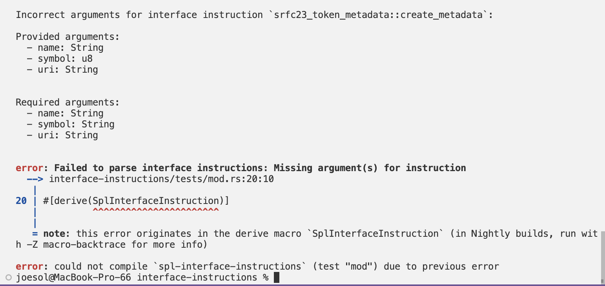

# sRFC Interface Discriminators

This repository serves as a spec for how a developer might implement one or more interfaces for their program in each common toolset (Anchor, Shank, Native).

The crate `interface-instructions` provides a few key components:

- Derive macro `#[derive(SplInterfaceInstruction)]` for Shank & Native programs
- Validation and discriminator builder functions powering the derive macro and Anchor's `#[program]` macro
- Helpful errors for enforcing all required instructions for an interface have been implemented

> Note: You will need Solana CLI version `1.16.0` to build this repository.

### Errors

✨
An example of an error thrown if you omit an instruction required by an interface:

```rust
#[derive(SplInterfaceInstruction)]
pub enum SampleTokenA {
    #[interface(srfc20_token::mint_to)]
    MintTo { amount: u64 },
    // #[interface(srfc20_token::transfer)]
    // Transfer { amount: u64 },
}
```



✨ An example of an error thrown if you provide an instruction not part of the declared interface:

```rust
#[derive(SplInterfaceInstruction)]
pub enum SampleTokenA {
    #[interface(srfc20_token::joe)] // Invalid instruction
    MintTo { amount: u64 },
    #[interface(srfc20_token::transfer)]
    Transfer { amount: u64 },
}
```



✨ An example of an error thrown if you provide an incorrect argument:

```rust
#[derive(SplInterfaceInstruction)]
pub enum SampleTokenC {
    #[interface(srfc23_token_metadata::create_metadata)]
    CreateMetadata {
        name: String,
        symbol: u8, // Incorrect arg
        uri: String,
    },
    #[interface(srfc23_token_metadata::update_metadata)]
    UpdateMetadata {
        name: String,
        symbol: String,
        uri: String,
    },
}
```



✨ You can name your instruction whatever you want. The annotation will determine the interface instruction and subsequently the instruction discriminator:

```rust
#[derive(SplInterfaceInstruction)]
pub enum SampleTokenA {
    #[interface(srfc20_token::mint_to)]
    Darryl { amount: u64 },
    #[interface(srfc20_token::transfer)]
    Transfer { amount: u64 },
}
```
